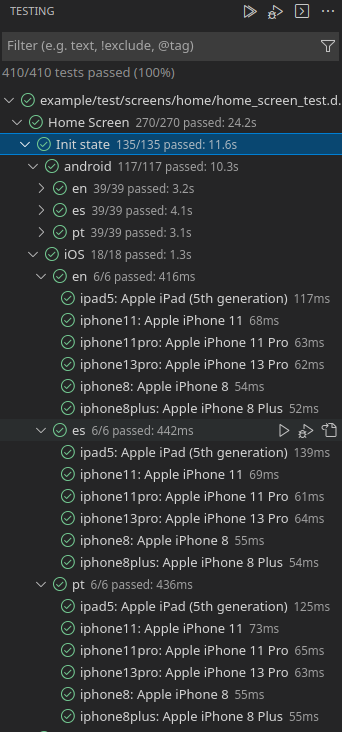
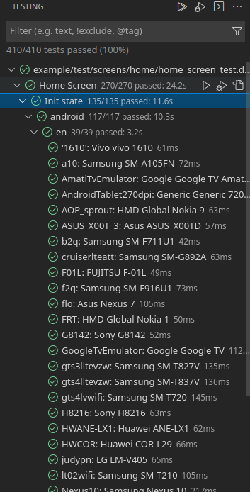
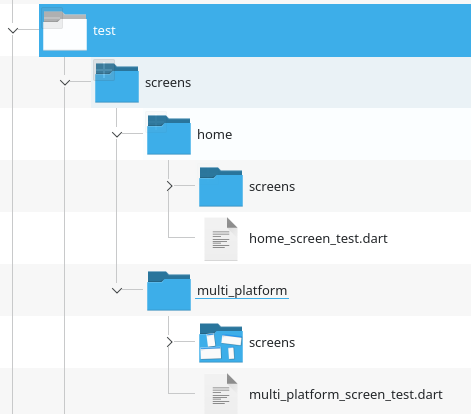
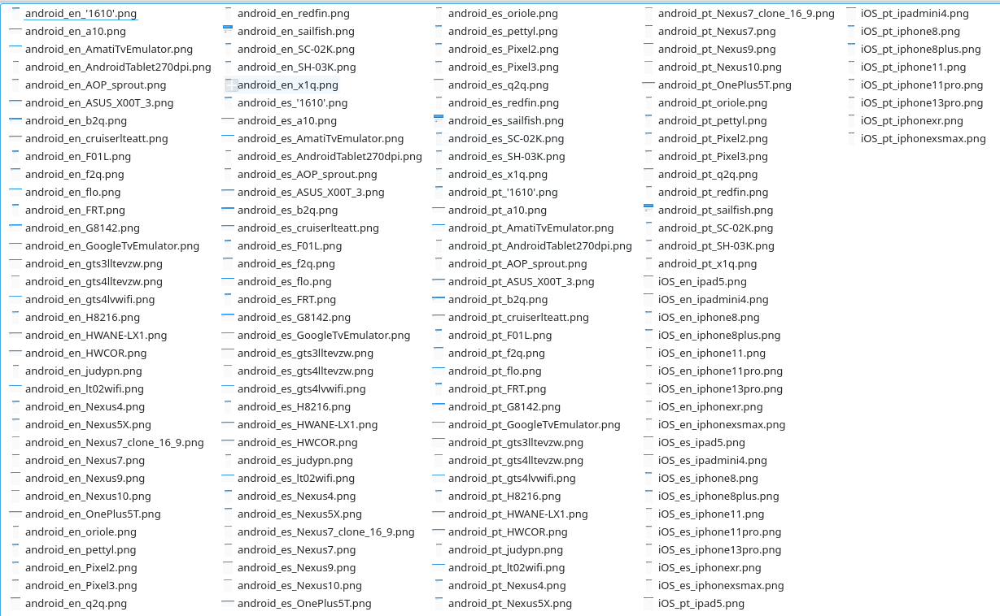
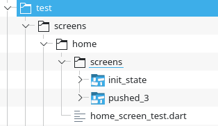
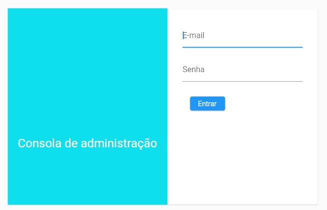
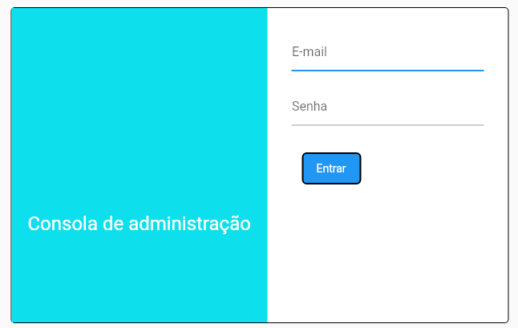

# Test Screen

 [](https://pub.dev/packages/test_screen)

This project contains APIs and utilities that build upon [Flutter's Golden test](https://github.com/flutter/flutter/wiki/Writing-a-golden-file-test-for-package:flutter) functionality to provide powerful UI regression tests.

<!-- It is highly recommended to look at sample tests here: [golden_builder_test.dart](test/golden_builder_test.dart) -->

_A Note on Golden Testing:_

Goldens aren't intended to be a replacement of typical behavioral widget testing that you should perform. What they provide is an automated way to provide regression testing for all of the visual details that can't be validated without manual verification.

The Golden assertions take longer to execute than traditional widget tests, so it is recommended to be intentional about when they are used. Additionally, they can have many reasons to change. Often, the primary reason a golden test will fail is because of an intentional change. Thankfully, Flutter makes it easy to regenerate new reference images.

## Table of Contents

<!-- @import "[TOC]" {cmd="toc" depthFrom=1 depthTo=6 orderedList=false} -->

<!-- code_chunk_output -->

- [Test Screen](#test-screen)
  - [Table of Contents](#table-of-contents)
  - [How it works?](#how-it-works)
  - [Getting Started](#getting-started)
    - [Setup](#setup)
      - [Add the failures and screens directories to .gitignore](#add-the-failures-and-screens-directories-to-gitignore)
      - [Add a "screen" and "screen_ui" tag to your project](#add-a-screen-and-screen_ui-tag-to-your-project)
      - [Configure VS Code](#configure-vs-code)
      - [Add the package to pubspec](#add-the-package-to-pubspec)
  - [Creating screen tests](#creating-screen-tests)
    - [Global configuration](#global-configuration)
      - [Adding Android / iOS devices from Firebase Test Lab](#adding-android-ios-devices-from-firebase-test-lab)
      - [Other TestScreenConfig parameters](#other-testscreenconfig-parameters)
      - [Platform vs ThemeData.platform](#platform-vs-themedataplatform)
        - [When use Platform and when ThemeData.platform?](#when-use-platform-and-when-themedataplatform)
        - [ThemeData.platform (TargetPlatform) on web applications](#themedataplatform-targetplatform-on-web-applications)
    - [Create screen tests](#create-screen-tests)
    - [Other utility classes](#other-utility-classes)
      - [`WidgetTester` extension.](#widgettester-extension)
      - [ChildrenWithSomeOrderMatcher](#childrenwithsomeordermatcher)
      - [TestScreenDevice.forWeb](#testscreendeviceforweb)
  - [Golden files shadows](#golden-files-shadows)
  - [3rd Party Software Included or Modified in Project](#3rd-party-software-included-or-modified-in-project)

<!-- /code_chunk_output -->
## How it works?

First, you define globally the locales, platforms and devices for your UI tests.

For every UI test, a concrete test for every platform, every locale and every device defined in the configuration will be created. On VSC is viewed like a group of platforms, with a group of locales and a test for every device:




Before run the tests the first time, you must create the screens (golden files) that will be used like the reference for determining that the UI tests are correct. You do this with a command from the terminal or, if VSC is configured, directly from VSC. This creates on the directory, where the tests are created, a directory with the name `screens`:



Inside that directory, the golden files will be created:



That's all. When the test runs, it compares the screen generated by the tests with these golden files. If something are different, the test fails.

If the test fail, a `failures` directory will be created with the fail information. 

## Getting Started

### Setup

If you are new to Flutter's Golden testing, there are a few things you might want to do.

#### Add the failures and screens directories to .gitignore

When golden tests fail, artifacts are generated in a `failures` directory adjacent to your test. These are not intended to be tracked in source control.

```
.gitignore

test/**/failures
```

If you don't want to track the generated screens, add the `screens` directory too:

```
.gitignore

test/**/screens
```

#### Add a "screen" and "screen_ui" tag to your project

Add a `dart_test.yaml` file to the root of your project with the following content:

```yaml
tags:
  screen:
  screen_ui:
```

This will indicate that `screen` and `screen_ui` are an expected test tag. All tests that use `testScreen()` or `testScreenUI()` will automatically be given this tag.
This allows you to easily target `screen` or `screen_ui` tests from the command-line.

#### Configure VS Code

If you use VSCode, we highly recommend adding this configuration to your `.vscode/launch.json` file in the root of your workspace.

```json
{
  // Use IntelliSense to learn about possible attributes.
  // Hover to view descriptions of existing attributes.
  // For more information, visit: https://go.microsoft.com/fwlink/?linkid=830387
  "version": "0.2.0",
  "configurations": [
    {
      "name": "Create Screens",
      "request": "launch",
      "type": "dart",
      "codeLens": {
        "for": ["run-test", "run-test-file"]
      },
      "args": ["--update-goldens"]
    }
  ]
}
```

This give you a context menu where you can easily regenerate the screens for a particular test directly from the IDE:


#### Add the package to pubspec

This package is used in development, so add the dependency on `dev_dependencies`:

```bash
flutter pub add test_screen --dev
```
## Creating screen tests
Creating screen tests are divided in two steps:
- Create a global configuration of platforms, locales and devices for testing.
- [Create screen tests](#create-screen-tests).

### Global configuration
Initialize the global configuration in the `flutter_test_config.dart` file.

Before a test file is executed, the Flutter test framework will scan up the directory hierarchy, starting from the directory in which the test file resides, looking for a file named `flutter_test_config.dart` (https://api.flutter.dev/flutter/flutter_test/flutter_test-library.html).

Use `initializeDefaultTestScreenConfig` for creating the configuration:

```dart
Future<void> initializeDefaultTestScreenConfig(TestScreenConfig config,
    {List<TestScreenFont> fonts = const [],
    bool loadDefaultFonts = true})
```

`TestScreenConfig` class defines the locales and devices to test. 

```dart
    TestScreenConfig(
      locales: [
        'es',
        'pt',
        'en'
      ],
      devices: {
        TargetPlatform.android: [
            const TestScreenDevice(
              id: 'S2',
              manufacturer: 'Samsung',
              name: 'Galaxy S2',
              size: Size(1200, 1600),
              devicePixelRatio: 1.0),
           const TestScreenDevice(
              id: 'LX1',
              manufacturer: 'Huawei',
              name: 'AME-LX1',
              size: Size(1080, 2280),
              devicePixelRatio: 2.0),
            ],
        TargetPlatform.iOS: [
          const TestScreenDevice(
              id: 'i8',
              manufacturer: 'Apple',
              name: 'iPhone 8',
              size: Size(1334, 750),
              devicePixelRatio: 2.0),
        ]
      }
    )
```

`flutter_test_config.dart` example:
```dart
Future<void> testExecutable(FutureOr<void> Function() testMain) async {
  initializeDefaultTestScreenConfig(
    TestScreenConfig(
      locales: [
        'es',
        'pt',
        'en'
      ],
      devices: {
        TargetPlatform.android: [
            const TestScreenDevice(
              id: 'S2',
              manufacturer: 'Samsung',
              name: 'Galaxy S2',
              size: Size(1200, 1600),
              devicePixelRatio: 1.0),
           const TestScreenDevice(
              id: 'LX1',
              manufacturer: 'Huawei',
              name: 'AME-LX1',
              size: Size(1080, 2280),
              devicePixelRatio: 2.0),
            ],
        TargetPlatform.iOS: [
          const TestScreenDevice(
              id: 'i8',
              manufacturer: 'Apple',
              name: 'iPhone 8',
              size: Size(1334, 750),
              devicePixelRatio: 2.0),
        ]
      }));
  return testMain();
}
```
#### Adding Android / iOS devices from Firebase Test Lab
The `AndroidFirebaseTestLab` and `IosFirebaseTestLab` classes allow to import the Android and iOS devices defined in Firebase Test Lab. The method `devices()` returns the list of devices.

The first time, `AndroidFirebaseTestLab` and `IosFirebaseTestLab` connects to Firebase Test Lab and downloads the Android and iOS models definitions, creating a cache file named `firebase_test_lab_android_devices.csv` or `firebase_test_lab_ios_devices.csv`. By default, it is created on `test` directory. You can change the default path in a constructor argument.

They use `gcloud` CLI tools, so it's necessary to be installed and logged.

After the cache file is created, `AndroidFirebaseTestLab` and `IosFirebaseTestLab` always use it, and never connects again to Firebase Test Lab. If you don't want to test some model, open the cache file `firebase_test_lab_android_devices.csv` or `firebase_test_lab_ios_devices.csv` and delete the row that contains the model definition. Delete the cache file for recreating it.
  
Use `AndroidFirebaseTestLab` and `IosFirebaseTestLab` in `initializeDefaultTestScreenConfig`:

```dart
Future<void> testExecutable(FutureOr<void> Function() testMain) async {

  initializeDefaultTestScreenConfig(TestScreenConfig(
      locales: [
        'es',
        'pt',
        'en'
      ],
      devices: {
        TargetPlatform.android: await AndroidFirebaseTestLab().devices(),
        TargetPlatform.iOS: await IosFirebaseTestLab().devices(),
      },
      ...

```

In the example project, in the `test` directory, you can find the `firebase_test_lab_android_devices.csv` and `firebase_test_lab_ios_devices.csv` files generated when the tests for example project was executed. If prefer, you can use it.


#### Other TestScreenConfig parameters
For every test, `onBeforeCreate`, `wrapper` and `onAfterCreate` are called.
The screen widget to test is created in this order: first `onBeforeCreate` is called. Next is called the `createScreen` callback defined on the test. Next is called `wrapper` for wrapping the created screen and finally `onAfterCreate` is called.

If your screen widget needs a parent for running, like `MaterialApp`, use the `wrapper` parameter. The `wrapper` method will be called with the widget screen to test.

```dart
    wrapper: (Widget screen) =>
          MaterialApp(
            debugShowCheckedModeBanner: false,
            theme: ThemeData(
              primarySwatch: Colors.blue,
            ),
            home: screen,
            localizationsDelegates: AppLocalizations.localizationsDelegates,
            supportedLocales: AppLocalizations.supportedLocales,
          )));
```

#### Platform vs ThemeData.platform
If uses `Platform` for some specific platform code, the code is only testable in that platform.

For example, if the test are running on linux and is doing tests for Android app, Platform.isAndroid returns false. 

```dart
@override
Widget build(BuildContext context) {
  if (Platform.isAndroid) 
    return buildRaisedButton();
  else if (Platform.isIOS)
    return buildCupertinoButton();
  else 
    throw UnsupportedError('Only Android and iOS are supported.');
}
```

To avoid this problem, use `ThemeData.platform`:

```dart
@override
Widget build(BuildContext context) {
  final platform = Theme.of(context).platform;

  if (platform == TargetPlatform.iOS) 
    return buildCupertinoButton();
  else 
    ...
}
```
See an example on `lib/screens/multi_platform/multi_platform_screen.dart` on the example project.


##### When use Platform and when ThemeData.platform?

Use `Platform` when your code depends on some specific platform functionality. Keep in mind that this code is only testable in that platform.

Use `ThemeData.platform` if the code runs on all platforms, but only adapts depends on the platform. For example on the previous UI example.

##### ThemeData.platform (TargetPlatform) on web applications

`ThemeData.platform` returns a `TargetPlatform` enum. This enum hasn't a value for web applications. If your UI is multiplatform and needs to adapt to web, you need to use the global constant [`kIsWeb`](https://api.flutter.dev/flutter/foundation/kIsWeb-constant.html). Using `kIsWeb` has the same results than using `Platform`, it can only execute the code on a web environment, so it can't do tests on your development environment (Windows, linux, ...).

To avoid this problem, `test_screen` package uses the package `ui_target_platform` for enumerating platforms. `ui_target_platform` defines the enum `UITargetPlatform`, that is the same than `TargetPlatform` but with a new value: `web`.

Why has it been created in a separate package? Because if you need to use it, you need to import it in your code, and your code only needs this enum, not all the `test_screen` code.

For example:
```dart
  @override
  Widget build(BuildContext context) {
    final platform =
        UITargetPlatform.fromTargetPlatform(Theme.of(context).platform);
    return Scaffold(
        body: Column(
      children: [
        const SizedBox(
          height: 30,
        ),
        Text(platform.toString()),
        SizedBox(width: 200, child: _slider(platform)),
      ],
    ));
  }

  StatefulWidget _slider(UITargetPlatform platform) {
    switch (platform) {
      case UITargetPlatform.iOS:
        return _cupertinoSlider();
      case UITargetPlatform.web:
        return _webSlider();
      default:
        return _defaultSlider();
    }
  }
```
You can see how `UITargetPlatform` is obtained from `ThemeData.platform` and is used like `TargetPlatform`, but with a new value, `UITargetPlatform.web`.

Install the package to use it:

```bash
flutter pub add ui_target_platform
```


### Create screen tests

_See the example project_

Use `testScreenUI` for creating UI tests. You must pass a description and a callback to an async function that creates your screen.
```dart
void main() {
  group('Home Screen', () {
    testScreenUI('Init state', () async => const HomeScreen());
    ...
```

Before run the test the first time, you must create the golden files (see [How it works?](#how-it-works)).

Normally you want to test your screen in different states. Different states generates differents screens. To allow this, `testScreenUI` has the optional parameter `goldenDir`. This parameter creates a subdirectory inside the screens directory, allowing to separate the different screens for every state.

For example, in the example project, the Home screen is tested in 2 different states, when the screen appears and after the user pushes the button three times:

```dart
void main() {
  group('Home Screen', () {

    testScreenUI('Init state', () async => const HomeScreen(),
      goldenDir: 'init_state');
  
    testScreenUI('Pushed button 3 times', () async => const HomeScreen(),
      goldenDir: 'pushed_3',
      onTest: (WidgetTester tester) async {
        for (int i = 0; i < 3; i++) {
          await tester.tap(find.byType(FloatingActionButton));
          await tester.pump();
        }
      });
  });
}
```
You could see than `testScreenUI` have different goldenDir arguments. The test `Init state` creates the golden files in the `init_state` subdirectory and the test `Pushed button 3 times` in the `pushed_3` subdiretory:



Every time the test is executed, the screen created by the test is compared with the png file of the golden dir. This consumes a lot of time. You can avoid this comparation using `testScreen`. It does exactly the same than `testScreenUI`, but doesn't do the bitmap comparation.

### Other utility classes
#### `WidgetTester` extension.
It has methods for obtaining locale, locales, devicePixelRatio and size.

#### ChildrenWithSomeOrderMatcher
Compare the Actual finder children with the [finders] sequencially.
```dart
 ListView(
  children: [
    const YourWidget(),
    AnotherWidget(),
    Container(
      child: Text('Hello'),
    ),
    Padding(
      padding: const EdgeInsets.all(8.0),
      child: Column(
        children: [Widget1(),
                  Widget2()],
      ),
    ),
  ],
);
```
Match:
```dart
expect(
  find.byType(ListView),
  ChildrenWithSomeOrderMatcher([
    find.byType(YourWidget),
    find.text('Hello'),
    find.byType(Widget2),
]));
```
No match:
```dart
expect(
  find.byType(ListView),
  ChildrenWithSomeOrderMatcher([
    find.text('Hello'),
    find.byType(YourWidget),
    find.byType(Widget2),
]));
```
#### TestScreenDevice.forWeb
Returns a `TestScreenDevice` for a web screen. It only defaults  `TestScreenDevice` constructor values, so it's more readable and easy for defining web screen sizes:

```dart
initializeDefaultTestScreenConfig(TestScreenConfig(
      devices: {
        UITargetPlatform.web: [
          TestScreenDevice.forWeb(1280, 720),
          TestScreenDevice.forWeb(800, 600)
          ],
      },
```

The defaults values are:
```
  id: 'web_${width}x${height}'
  manufacturer: 'web'
  name: '${width}x${height}'
  devicePixelRatio: 1.0
```

## Golden files shadows
Flutter test disables, by default, all the shadows, and replaces it with a solid color.

For example, for this screen:



the golden file generated is:



The reason is: 
> the rendering of shadows is not guaranteed to be pixel-for-pixel identical from version to version (or even from run to run)."

However, if you want to disable this behavior, you can change the value of the global variable `debugDisableShadows`.

The help of this variable says: 
> Whether to replace all shadows with solid color blocks.
> 
> This is useful when writing golden file tests (see [matchesGoldenFile]) since
> the rendering of shadows is not guaranteed to be pixel-for-pixel identical from
> version to version (or even from run to run).
> 
> In those tests, this is usually set to false at the beginning of a test and back
> to true before the end of the test case.
> 
> If it remains true when the test ends, an exception is thrown to avoid state
> leaking from one test case to another.

So, remember to put this variable to `true` after the test ends, else it fails.

For example:
```dart
group('Login Screen', () {
    setUp(() => debugDisableShadows = false);
    testScreenUI('Screen', () async => const LoginScreen(),
        onTest: (tester) async {
      // test code
      // ...
      debugDisableShadows = true;
    });
  });
```


## 3rd Party Software Included or Modified in Project
  - font_loader.dart from Goolden Toolkit: https://pub.dev/packages/golden_toolkit
  - Roboto Font File: Available at URL: https://github.com/google/fonts/tree/master/apache/roboto License: Available under Apache license at https://github.com/google/fonts/blob/master/apache/roboto/LICENSE.txt
  - SFProDisplay and SFProText Font Files: Available at URL: https://fontsfree.net