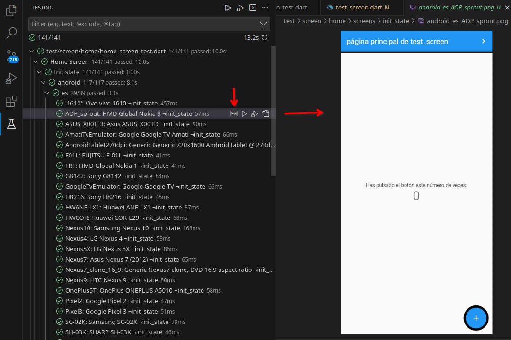
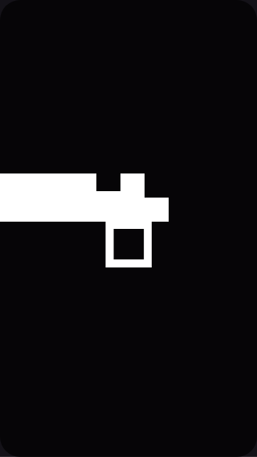
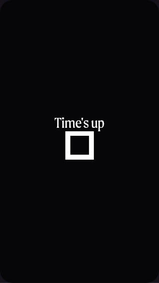
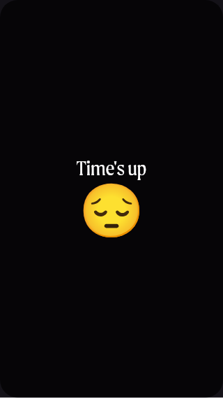
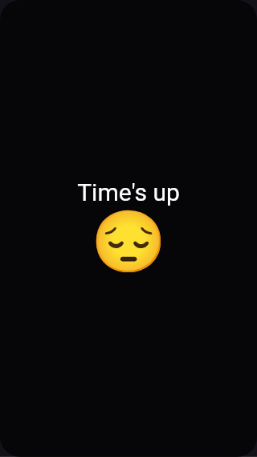

# Test Screen

 [](https://pub.dev/packages/test_screen)

This project contains APIs and utilities that build upon [Flutter's Golden test](https://github.com/flutter/flutter/wiki/Writing-a-golden-file-test-for-package:flutter) functionality to provide powerful UI regression tests.

<!-- It is highly recommended to look at sample tests here: [golden_builder_test.dart](test/golden_builder_test.dart) -->

_A Note on Golden Testing:_

Goldens aren't intended to be a replacement of typical behavioral widget testing that you should perform. What they provide is an automated way to provide regression testing for all of the visual details that can't be validated without manual verification.

The Golden assertions take longer to execute than traditional widget tests, so it is recommended to be intentional about when they are used. Additionally, they can have many reasons to change. Often, the primary reason a golden test will fail is because of an intentional change. Thankfully, Flutter makes it easy to regenerate new reference images.

## What's new

- Fonts breaking change. Now initialized on `TestScreenConfig`. See [Fonts](#fonts).
  
- [IMPORTANT: initializeDefaultTestScreenConfig simulatedPlatformFontsCacheDirectory](#important-initializedefaulttestscreenconfig-simulatedplatformfontscachedirectory)

- [Loading emoji font only when needed](#loading-emoji-font-only-when-needed)

## Table of Contents

<!-- @import "[TOC]" {cmd="toc" depthFrom=1 depthTo=7 orderedList=false} -->
- [Test Screen](#test-screen)
  - [What's new](#whats-new)
  - [Table of Contents](#table-of-contents)
  - [How it works?](#how-it-works)
  - [Getting Started](#getting-started)
    - [Setup](#setup)
      - [Add the failures and screens directories to .gitignore](#add-the-failures-and-screens-directories-to-gitignore)
      - [Add a "screen" and "screen\_ui" tag to your project](#add-a-screen-and-screen_ui-tag-to-your-project)
      - [Configure Visual Studio Code](#configure-visual-studio-code)
        - [launch.json](#launchjson)
        - [Test Screen extension](#test-screen-extension)
      - [Add the package to pubspec](#add-the-package-to-pubspec)
  - [Creating screen tests](#creating-screen-tests)
    - [Global configuration](#global-configuration)
      - [Adding Android / iOS devices from Firebase Test Lab](#adding-android--ios-devices-from-firebase-test-lab)
      - [Adding web screens](#adding-web-screens)
      - [Fonts](#fonts)
        - [Understanding loadSimulatedPlatformFonts](#understanding-loadsimulatedplatformfonts)
          - [What purpose can be serve if loadSimulatedPlatformFonts is empty?](#what-purpose-can-be-serve-if-loadsimulatedplatformfonts-is-empty)
          - [IMPORTANT: initializeDefaultTestScreenConfig simulatedPlatformFontsCacheDirectory](#important-initializedefaulttestscreenconfig-simulatedplatformfontscachedirectory)
          - [Loading emoji font only when needed](#loading-emoji-font-only-when-needed)
        - [IMPORTANT: initializeDefaultTestScreenConfig libraryName](#important-initializedefaulttestscreenconfig-libraryname)
      - [Other TestScreenConfig parameters](#other-testscreenconfig-parameters)
    - [Create screen tests](#create-screen-tests)
      - [Platform vs ThemeData.platform](#platform-vs-themedataplatform)
        - [When use Platform and when ThemeData.platform?](#when-use-platform-and-when-themedataplatform)
        - [ThemeData.platform on web applications](#themedataplatform-on-web-applications)
      - [Golden files shadows](#golden-files-shadows)
      - [Testing Dialogs or other complex components](#testing-dialogs-or-other-complex-components)
    - [Other utility function / classes](#other-utility-function--classes)
      - [wrapWidget function](#wrapwidget-function)
      - [`WidgetTester` extension.](#widgettester-extension)
      - [ChildrenWithSomeOrderMatcher](#childrenwithsomeordermatcher)
  - [3rd Party Software Included](#3rd-party-software-included)
<!-- /code_chunk_output -->
## How it works?

First, you define globally the locales, platforms and devices for your UI tests.

For every UI test, a concrete test for every platform, every locale and every device defined in the configuration will be created. On VSC is viewed like a group of platforms, with a group of locales and a test for every device:


Before run the tests the first time, you must create the screens (golden files) that will be used like the reference for determining that the UI tests are correct. You do this with a command from the terminal or, if VSC is configured, directly from VSC. This creates on the directory, where the tests are created, a directory with the name `screens`:


Inside that directory, the golden files will be created:


That's all. When the test runs, it compares the screen generated by the tests with these golden files. If something are different, the test fails.

If the test fail, a `failures` directory will be created with the fail information. 

## Getting Started

### Setup

If you are new to Flutter's Golden testing, there are a few things you might want to do.

#### Add the failures and screens directories to .gitignore

When golden tests fail, artifacts are generated in a `failures` directory adjacent to your test. These are not intended to be tracked in source control.

```
.gitignore

test/**/failures
```

If you don't want to track the generated screens, add the `screens` directory too:

```
.gitignore

test/**/screens
```

#### Add a "screen" and "screen_ui" tag to your project

Add a `dart_test.yaml` file to the root of your project with the following content:

```yaml
tags:
  screen:
  screen_ui:
```

This will indicate that `screen` and `screen_ui` are an expected test tag. All tests that use `testScreen()` or `testScreenUI()` will automatically be given this tag.
This allows you to easily target `screen` or `screen_ui` tests from the command-line.

#### Configure Visual Studio Code

##### launch.json

If you use VSC, we highly recommend adding this configuration to your `.vscode/launch.json` file in the root of your workspace.

```json
{
  // Use IntelliSense to learn about possible attributes.
  // Hover to view descriptions of existing attributes.
  // For more information, visit: https://go.microsoft.com/fwlink/?linkid=830387
  "version": "0.2.0",
  "configurations": [
    {
      "name": "Create Screens",
      "request": "launch",
      "type": "dart",
      "codeLens": {
        "for": ["run-test", "run-test-file"]
      },
      "args": ["--update-goldens"]
    }
  ]
}
```

This give you a context menu where you can easily regenerate the screens for a particular test directly from the IDE:


##### Test Screen extension

If you use VSC, we highly recommend adding the extension [Test Screen](vsc_extension/test-screen-1.0.0.vsix).

This extension allows to open the images created by test_screen inside VSC.

On testing appears a new icon for every test. When the icon is clicked, if the node of the tree corresponds to a test status generated by test_screen, it opens inside VSC the image created by that test.



Download from [vsc_extension/test-screen-1.0.0.vsix](vsc_extension/test-screen-1.0.0.vsix).

To install a VSIX extension in VSC, you can follow these steps:

- Open Visual Studio Code.
- Go to the Extensions view (Ctrl+Shift+X).
- Click on the ... (More Actions) button in the top right corner of the Extensions view.
- Select ‘Install from VSIX…’ from the dropdown menu.
- In the file dialog that opens, select the .vsix file.

Alternatively, you can use the Command Palette (Ctrl+Shift+P) to run the Extensions: Install from VSIX... command.

Or by the command line:
```bash
code --install-extension test-screen-1.0.0.vsix
```


#### Add the package to pubspec

This package is used in development, so add the dependency on `dev_dependencies`:

```bash
flutter pub add test_screen --dev
```
## Creating screen tests
Creating screen tests are divided in two steps:
- Create a global configuration of platforms, locales and devices for testing.
- [Create screen tests](#create-screen-tests).

### Global configuration
Initialize the global configuration in the `flutter_test_config.dart` file.

Before a test file is executed, the Flutter test framework will scan up the directory hierarchy, starting from the directory in which the test file resides, looking for a file named `flutter_test_config.dart` (https://api.flutter.dev/flutter/flutter_test/flutter_test-library.html).

Use `initializeDefaultTestScreenConfig` for creating the configuration:

```dart
Future<void> initializeDefaultTestScreenConfig(TestScreenConfig config, ...)
```

`TestScreenConfig` class defines the locales and devices to test. 

```dart
    TestScreenConfig(
      locales: [
        'es',
        'pt',
        'en'
      ],
      devices: {
        UITargetPlatform.android: [
            const TestScreenDevice(
              id: 'S2',
              manufacturer: 'Samsung',
              name: 'Galaxy S2',
              size: Size(1200, 1600),
              devicePixelRatio: 1.0),
           const TestScreenDevice(
              id: 'LX1',
              manufacturer: 'Huawei',
              name: 'AME-LX1',
              size: Size(1080, 2280),
              devicePixelRatio: 2.0),
            ],
        UITargetPlatform.iOS: [
          const TestScreenDevice(
              id: 'i8',
              manufacturer: 'Apple',
              name: 'iPhone 8',
              size: Size(1334, 750),
              devicePixelRatio: 2.0),
        ]
      }
    )
```

`flutter_test_config.dart` example:
```dart
Future<void> testExecutable(FutureOr<void> Function() testMain) async {
  await initializeDefaultTestScreenConfig(
    TestScreenConfig(
      locales: [
        'es',
        'pt',
        'en'
      ],
      devices: {
        UITargetPlatform.android: [
            const TestScreenDevice(
              id: 'S2',
              manufacturer: 'Samsung',
              name: 'Galaxy S2',
              size: Size(1200, 1600),
              devicePixelRatio: 1.0),
           const TestScreenDevice(
              id: 'LX1',
              manufacturer: 'Huawei',
              name: 'AME-LX1',
              size: Size(1080, 2280),
              devicePixelRatio: 2.0),
            ],
        UITargetPlatform.iOS: [
          const TestScreenDevice(
              id: 'i8',
              manufacturer: 'Apple',
              name: 'iPhone 8',
              size: Size(1334, 750),
              devicePixelRatio: 2.0),
        ]
      }));
  return testMain();
}
```
#### Adding Android / iOS devices from Firebase Test Lab
The `AndroidFirebaseTestLab` and `IosFirebaseTestLab` classes allow to import the Android and iOS devices defined in Firebase Test Lab. The method `devices()` returns the list of devices.

The first time, `AndroidFirebaseTestLab` and `IosFirebaseTestLab` connects to Firebase Test Lab and downloads the Android and iOS models definitions, creating a cache file named `firebase_test_lab_android_devices.csv` or `firebase_test_lab_ios_devices.csv`. By default, it is created on `test` directory. You can change the default path in a constructor argument.

They use `gcloud` CLI tools, so it's necessary to be installed and logged.

After the cache file is created, `AndroidFirebaseTestLab` and `IosFirebaseTestLab` always use it, and never connects again to Firebase Test Lab. If you don't want to test some model, open the cache file `firebase_test_lab_android_devices.csv` or `firebase_test_lab_ios_devices.csv` and delete the row that contains the model definition. Delete the cache file for recreating it.
  
Use `AndroidFirebaseTestLab` and `IosFirebaseTestLab` in `initializeDefaultTestScreenConfig`:

```dart
Future<void> testExecutable(FutureOr<void> Function() testMain) async {

  initializeDefaultTestScreenConfig(TestScreenConfig(
      locales: [
        'es',
        'pt',
        'en'
      ],
      devices: {
        UITargetPlatform.android: await AndroidFirebaseTestLab().devices(),
        UITargetPlatform.iOS: await IosFirebaseTestLab().devices(),
      },
      ...

```

In the example project, in the `test` directory, you can find the `firebase_test_lab_android_devices.csv` and `firebase_test_lab_ios_devices.csv` files generated when the tests for example project was executed. If prefer, you can use it.

Both classes have some constructor parameters to control the devices that returns:
  - excludeSameLogicalSize: If a device is find with the same logical size than another device that already exists in the devices list, it is ignored.
  - excludeTablets: If a device has width greater than height, it's ignored.
  - excludeModels: Doesn't include in the device list these models.  

#### Adding web screens 
`TestScreenDevice.forWeb` returns a `TestScreenDevice` for a web screen. It only defaults `TestScreenDevice` constructor values, so it's more readable and easy for defining web screen sizes:

```dart
initializeDefaultTestScreenConfig(TestScreenConfig(
      devices: {
        UITargetPlatform.webWindows: [
          TestScreenDevice.forWeb(1280, 720),
          TestScreenDevice.forWeb(800, 600)
          ],
      },
```

The defaults values are:
```
  id: 'web_${width}x${height}'
  manufacturer: 'web'
  name: '${width}x${height}'
  devicePixelRatio: 1.0
```

#### Fonts
By default, all the fonts used in the project are loaded automatically.

test_screen includes also simulated system fonts.

`TestScreenConfig` allows to fine tuning the loaded fonts.

```dart
TestScreenConfig(
    {...
      this.fonts = const [],
      this.loadDefaultFonts = true,
      this.loadSimulatedPlatformFonts = const {
        SimulatedPlatformFonts.roboto,
        SimulatedPlatformFonts.sfProText,
      }
    })
```
- `fonts`: Loads these fonts.
- `loadDefaultFonts`: Load all the fonts used in the project.
- `loadSimulatedPlatformFonts`: A set of `SimulatedPlatformFonts` specifying what simulated fonts to load:
    - Android: Roboto.
    - iOS: SF Pro Display, SF Pro Text, SF UI Display, SF UI Text fonts.
    - Other: Roboto.
  
   For all the platforms, font family fallback NotoColorEmoji. This allows to show emojis.


##### Understanding loadSimulatedPlatformFonts
Different platforms, like Android or iOS, have system fonts. To simulate this system fonts, test_screen includes a series of fonts for simulating it. The fonts specified in `TestScreenConfig` `loadSimulatedPlatformFonts` are loaded automatically.

For example in this code:
```dart
Column(
  children: [
    Text("Time's up",
         style: const TextStyle(
              fontSize: 30,
              color: Colors.white)),
    Text('😔', style: TextStyle(fontSize: 42))
  ])
```
Both Text font family defaults to system default. On Android font Roboto, on iOS font SF, ... 

If `loadSimulatedPlatformFonts` is empty:
```dart
  TestScreenConfig(
    loadSimulatedPlatformForms: const {}
  );
```
no system emulated fonts are loaded. 

Like system fonts aren't in your project, the result is:



If you specify a fontFamily that exist in your project:

```dart
Column(
  children: [
    Text("Time's up",
         style: const TextStyle(
              fontFamily: 'myAppFontFamily',
              fontSize: 30,
              color: Colors.white)),
    Text('😔',
         style: TextStyle(
              fontFamily: 'myAppFontFamily',
              fontSize: 42))
  ])
```
and like `loadSimulatedPlatformFonts` is default to `SimulatedPlatformFonts.roboto` and `SimulatedPlatformFonts.sfProText`, and the myAppFontFamily is in your project, font is loaded, given this result:



What happen's with the emoji? Why is a rectangle?

Like your font hasn't all the UTF codes supported, Flutter tries to paint it with the system default font for emojis, but how doesn't exist, it paints a rectangle.

If `loadSimulatedPlatformFonts` is configured like this:
```dart
  TestScreenConfig(
    loadSimulatedPlatformForms: const {
      SimulatedPlatformFonts.roboto,
      SimulatedPlatformFonts.sfProText,
      SimulatedPlatformFonts.notoColorEmoji}
  );
```
 the system emulated NotoColorEmoji font is loaded. Like the second Text with the emoticon isn't supported by your myAppFontFamily, it falls back to the system default font for emojis, that now, test_screen is emulating with the NotoColorEmoji font. The result is:



Now, the first code example, without fontFamily
```dart
Column(
  children: [
    Text("Time's up",
         style: const TextStyle(
              fontSize: 30,
              color: Colors.white)),
    Text('😔', style: TextStyle(fontSize: 42))
  ])
```
will paint the Text with simulated fonts: First Text with Roboto for Android, SF for iOS, ..., and the second text (the emoji) with NotoColorEmoji. The result is:



###### What purpose can be serve if loadSimulatedPlatformFonts is empty?

To find texts that hasn't specified an application font family and falls on the default system fonts. 

The texts appears with the default Ahem test font, and only see the rectangles.


###### IMPORTANT: initializeDefaultTestScreenConfig simulatedPlatformFontsCacheDirectory

```dart
Future<void> initializeDefaultTestScreenConfig(TestScreenConfig config,
    {String? libraryName,
    Directory? simulatedPlatformFontsCacheDirectory}) async {}
```
test_screen library is used like a development library, so it's declared in pubspec dev_dependencies.

On previous versions of test_screen, simulated fonts were assets. Like test_screen is a development library, can imagine that the assets aren't included in release versions. But, Flutter has an open bug (https://github.com/flutter/flutter/issues/79261) for more than 4 years, where includes all the assets in the release version, even development libraries assets. This caused the final app to increase in size by more than 26MB, since the emoji font alone already weighed 23MB.

To solve this problem, now test_screen doesn't include assets. All the fonts are embedded in code. This brings up another problem. Like every test loads the fonts from code, when uses the emoji font, a variable of 23MB is created. This, using Visual Studio Code, consumes all the memory of the PC and hangs it, because memory isn't released.

To solve this problem, it is highly recommended to specify the argument `simulatedPlatformFontsCacheDirectory` on `initializeDefaultTestScreenConfig`. This directory is used for extracting the fonts embedded in the code. Then the tests directly use the sources from that directory, so the tests are much faster and the memory problem is avoided.

###### Loading emoji font only when needed

Like load the emoji font is costly in time and resources, is recommended to load the emoji font only for the test that requires it.

Use `TestScreenConfig.defaultConfigCopy` to copy the default configuration and add the emoji font:

Example:
```dart
testScreenUI(
      'emoji',
      config: TestScreenConfig.defaultConfigCopy(
          withLoadSimulatedPlatformFonts: {
            SimulatedPlatformFonts.roboto,
            SimulatedPlatformFonts.sFProText,
            SimulatedPlatformFonts.notoColorEmoji
          }),
      () async => Center(
            child: Text('Hola: 😀🤡'),
          ));
```


##### IMPORTANT: initializeDefaultTestScreenConfig libraryName

```dart
Future<void> initializeDefaultTestScreenConfig(TestScreenConfig config,
    {String? libraryName,
    Directory? simulatedPlatformFontsCacheDirectory}) async {}
```

- `libraryName`: If the project is a library, specify the library name. If not specified, fonts declared in pubspec can't load it.

#### Other TestScreenConfig parameters
For every test, `onBeforeCreate`, `wrapper` and `onAfterCreate` are called.
The screen widget to test is created in this order: first `onBeforeCreate` is called. Next is called the `createScreen` callback defined on the test. Next is called `wrapper` for wrapping the created screen and finally `onAfterCreate` is called.

If your screen widget needs a parent for running, like `MaterialApp`, use the `wrapper` parameter. The `wrapper` method will be called with the widget screen to test.

```dart
    wrapper: (WidgetTester tester, Widget screen) =>
          MaterialApp(
            debugShowCheckedModeBanner: false,
            theme: ThemeData(
              primarySwatch: Colors.blue,
            ),
            home: screen,
            localizationsDelegates: AppLocalizations.localizationsDelegates,
            supportedLocales: AppLocalizations.supportedLocales,
            locale: tester.platformDispatcher.locale,
          )));
```

### Create screen tests

_See the example project_

Use `testScreenUI` for creating UI tests. You must pass a description and a callback to an async function that creates your screen.
```dart
void main() {
  group('Home Screen', () {
    testScreenUI('Init state', () async => const HomeScreen());
    ...
```

Before run the test the first time, you must create the golden files (see [How it works?](#how-it-works)).

Normally you want to test your screen in different states. Different states generates different screens. To allow this, `testScreenUI` has the optional parameter `goldenDir`. This parameter creates a subdirectory inside the screens directory, allowing to separate the different screens for every state.

For example, in the example project, the Home screen is tested in 2 different states, when the screen appears and after the user pushes the button three times:

```dart
void main() {
  group('Home Screen', () {

    testScreenUI('Init state', () async => const HomeScreen(),
      goldenDir: 'init_state');
  
    testScreenUI('Pushed button 3 times', () async => const HomeScreen(),
      goldenDir: 'pushed_3',
      onTest: (WidgetTester tester) async {
        for (int i = 0; i < 3; i++) {
          await tester.tap(find.byType(FloatingActionButton));
          await tester.pump();
        }
      });
  });
}
```
You could see than `testScreenUI` have different goldenDir arguments. The test `Init state` creates the golden files in the `init_state` subdirectory and the test `Pushed button 3 times` in the `pushed_3` subdirectory:


Every time the test is executed, the screen created by the test is compared with the png file of the golden dir. This consumes a lot of time. You can avoid this comparison using `testScreen`. It does exactly the same than `testScreenUI`, but doesn't do the bitmap comparison.

#### Platform vs ThemeData.platform
If uses `Platform` for some specific platform code, the code is only testable in that platform.

For example, if the test are running on Linux and is doing tests for Android app, Platform.isAndroid returns false. 

```dart
@override
Widget build(BuildContext context) {
  if (Platform.isAndroid) 
    return buildRaisedButton();
  else if (Platform.isIOS)
    return buildCupertinoButton();
  else 
    throw UnsupportedError('Only Android and iOS are supported.');
}
```

To avoid this problem, use `ThemeData.platform`:

```dart
@override
Widget build(BuildContext context) {
  final platform = Theme.of(context).platform;

  if (platform == TargetPlatform.iOS) 
    return buildCupertinoButton();
  else 
    ...
}
```
See an example on `lib/screens/multi_platform/multi_platform_screen.dart` on the example project.


##### When use Platform and when ThemeData.platform?

Use `Platform` when your code depends on some specific platform functionality. Keep in mind that this code is only testable in that platform.

Use `ThemeData.platform` if the code runs on all platforms, but is adapting depending of the platform. For example on the previous UI example.

##### ThemeData.platform on web applications

`ThemeData.platform` returns a `TargetPlatform` enum. This enum hasn't a value for web applications. If your UI is multi platform and needs to adapt to web, you need to use the global constant [`kIsWeb`](https://api.flutter.dev/flutter/foundation/kIsWeb-constant.html). Using `kIsWeb` has the same results than using `Platform`, it can only execute the code on a web environment, so it can't do tests on your development environment (Windows, Linux, ...).

To avoid this problem, `test_screen` package uses the package `isweb_test`. It defines the global variable `debugIsWeb` and the function `isWeb`. The global variable `debugIsWeb` is used by `test_screen` for simulating the web environment. If you need to use `kIsWeb`, use `isWeb` function. It returns true if `kIsWeb` is true or `debugIsWeb` is true, so it allows to test web code.

Why has it been created in a separate package? Because if you need to use it, you need to import it in your code, and your code only needs this function, not all the `test_screen` code.

For example:
```dart
  @override
  Widget build(BuildContext context) {
    final platform =
        TargetPlatform.fromTargetPlatform(Theme.of(context).platform);
    return Scaffold(
        body: Column(
      children: [
        const SizedBox(
          height: 30,
        ),
        Text(platform.toString()),
        SizedBox(width: 200, child: _slider(platform)),
      ],
    ));
  }

  StatefulWidget _slider(TargetPlatform platform) {
    if isWeb() {
      return _webSlider();
    } else {
    switch (platform) {
      case TargetPlatform.iOS:
        return _cupertinoSlider();
      default:
        return _defaultSlider();
      }
    }
  }
```

Install the package to use it:

```bash
flutter pub add isweb_test
```

#### Golden files shadows
Flutter test disables, by default, all the shadows, and replaces it with a solid color.

For example, for this screen:


the golden file generated is:


The reason is: 
> the rendering of shadows is not guaranteed to be pixel-for-pixel identical from version to version (or even from run to run)."

However, if you want to disable this behavior, you can change the value of the global variable `debugDisableShadows`.

The help of this variable says: 
> Whether to replace all shadows with solid color blocks.
> 
> This is useful when writing golden file tests (see [matchesGoldenFile]) since
> the rendering of shadows is not guaranteed to be pixel-for-pixel identical from
> version to version (or even from run to run).
> 
> In those tests, this is usually set to false at the beginning of a test and back
> to true before the end of the test case.
> 
> If it remains true when the test ends, an exception is thrown to avoid state
> leaking from one test case to another.

So, remember to put this variable to `true` after the test ends, else it fails.

For example:
```dart
group('Login Screen', () {
    setUp(() => debugDisableShadows = false);
    testScreenUI('Screen', () async => const LoginScreen(),
        onTest: (tester) async {
      // test code
      // ...
      debugDisableShadows = true;
    });
  });
```
#### Testing Dialogs or other complex components
`testScreenUI` creates the golden image with the widget created by the callback function  `createScreen`.

Sometimes needs to create the golden image with another widget. One of this cases is a `Dialog`.

`testScreenUI` has the parameter `onMatchesGoldenFinder` to indicate what widget want to use for creating the golden image.

``` dart
void testScreenUI(Object description, Future<Widget> Function() createScreen,
    {Future<void> Function(WidgetTester tester)? onTest,
    Future<Finder> Function()? onMatchesGoldenFinder,
    String? goldenDir,
    TestScreenConfig? config,
    UITargetPlatform? onlyPlatform})
```
In this example, we want to create a golden image of a `Dialog`, that is shown when `showDialog` is invoked:

``` dart
 testScreenUI(
      'Dialog',
      () async => TextButton(
          onPressed: () => showDialog(NavigatorOf.navigatorKey.currentState!.context),
          child: const SizedBox.shrink()),
      onTest: (WidgetTester tester) async {
        final Finder finder = find.byType(TextButton);
        expect(finder, findsOneWidget);
        await tester.tap(finder);
        await tester.pumpAndSettle();
      },
      onMatchesGoldenFinder: () async => find.byType(Dialog));
  );


Future<void> showDialog(BuildContext context) {
  return showDialog(
      context: context,
      builder: (context) {
        return AlertDialog(
          backgroundColor: Colors.white,
        ...
```
`onMatchesGoldenFinder` is returning the `Finder` about the `Dialog` created by `showDialog`. This is the widget that is finally saved like the golden image.


### Other utility function / classes
#### wrapWidget function
Wraps a widget with the wrapper configured on initializeDefaultTestScreenConfig.

Example:

A wrapper defined in your initializeDefaultTestScreenConfig:

```dart
initializeDefaultTestScreenConfig(
    TestScreenConfig(
      ...
      wrapper: (WidgetTester tester, Widget screen) =>
            MaterialApp(
              debugShowCheckedModeBanner: false,
              theme: ThemeData(
                primarySwatch: Colors.blue,
              ),
              home: screen,
              localizationsDelegates: AppLocalizations.localizationsDelegates,
              supportedLocales: AppLocalizations.supportedLocales,
              locale: tester.platformDispatcher.locale,
            )));
```

When use wrapWidget in testWidget:

```dart

 testWidgets('Home', (WidgetTester tester) async {
    await tester.pumpWidget(wrapWidget(tester, const HomeScreen()));
    final Finder addIcon = find.byIcon(Icons.add);
    ...
```

Is equivalent to:
```dart

 testWidgets('Home', (WidgetTester tester) async {
    await tester.pumpWidget(
          MaterialApp(
            debugShowCheckedModeBanner: false,
            theme: ThemeData(
              primarySwatch: Colors.blue,
            ),
            home: const HomeScreen(),
            localizationsDelegates: AppLocalizations.localizationsDelegates,
            supportedLocales: AppLocalizations.supportedLocales,
          )));    
    final Finder addIcon = find.byIcon(Icons.add);
    ...
```

#### `WidgetTester` extension.
It has methods for obtaining locale, locales, devicePixelRatio and size.

#### ChildrenWithSomeOrderMatcher
Compare the Actual finder children with the [finders] sequentially.
```dart
 ListView(
  children: [
    const YourWidget(),
    AnotherWidget(),
    Container(
      child: Text('Hello'),
    ),
    Padding(
      padding: const EdgeInsets.all(8.0),
      child: Column(
        children: [Widget1(),
                  Widget2()],
      ),
    ),
  ],
);
```
Match:
```dart
expect(
  find.byType(ListView),
  ChildrenWithSomeOrderMatcher([
    find.byType(YourWidget),
    find.text('Hello'),
    find.byType(Widget2),
]));
```
No match:
```dart
expect(
  find.byType(ListView),
  ChildrenWithSomeOrderMatcher([
    find.text('Hello'),
    find.byType(YourWidget),
    find.byType(Widget2),
]));
```
## 3rd Party Software Included
  - Roboto Font file: Available at URL: https://github.com/google/fonts/tree/master/apache/roboto License: Available under Apache license at https://github.com/google/fonts/blob/master/apache/roboto/LICENSE.txt
  - SFProDisplay and SFProText Font Files: Available at URL: https://fontsfree.net
  - Noto Color Emoji file: Available at URL: https://fonts.google.com/noto/specimen/Noto+Color+Emoji License: Available under SIL Open Font, Version 1.1 at https://fonts.google.com/noto/specimen/Noto+Color+Emoji/license
