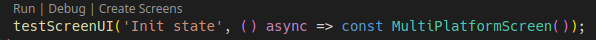

# Test Screen

<!-- [](https://pub.dev/packages/test_screen) [](https://travis-ci.org/eBay/flutter_glove_box) [](https://codecov.io/gh/eBay/flutter_glove_box) -->

This project contains APIs and utilities that build upon [Flutter's Golden test](https://github.com/flutter/flutter/wiki/Writing-a-golden-file-test-for-package:flutter) functionality to provide powerful UI regression tests.

<!-- It is highly recommended to look at sample tests here: [golden_builder_test.dart](test/golden_builder_test.dart) -->

It was inspired by the great toolkit [Golden Toolkit](https://pub.dev/packages/golden_toolkit).

## Status
- Testing the library in real projects
- Doing this readme documentation
- Creating an example project
- Documenting classes

## Table of Contents

- [Test Screen](#test-screen)
  - [Status](#status)
  - [Table of Contents](#table-of-contents)
  - [Getting Started](#getting-started)
    - [Setup](#setup)
      - [Add the failures and screens folder to .gitignore](#add-the-failures-and-screens-folder-to-gitignore)
      - [Add a "screen" and "screen_ui" tag to your project](#add-a-screen-and-screen_ui-tag-to-your-project)
      - [Configure VS Code](#configure-vs-code)
  - [Creating screen tests](#creating-screen-tests)
    - [Global configuration](#global-configuration)
      - [Adding Android devices from Firebase Test Lab](#adding-android-devices-from-firebase-test-lab)
      - [Other options of TestScreenConfig](#other-options-of-testscreenconfig)

## Getting Started

_A Note on Golden Testing:_

Goldens aren't intended to be a replacement of typical behavioral widget testing that you should perform. What they provide is an automated way to provide regression testing for all of the visual details that can't be validated without manual verification.

The Golden assertions take longer to execute than traditional widget tests, so it is recommended to be intentional about when they are used. Additionally, they can have many reasons to change. Often, the primary reason a golden test will fail is becaue of an intentional change. Thankfully, Flutter makes it easy to regenerate new reference images.


### Setup

If you are new to Flutter's Golden testing, there are a few things you might want to do

#### Add the failures and screens folder to .gitignore

When golden tests fail, artifacts are generated in a `failures` folder adjacent to your test. These are not intended to be tracked in source control.

```
.gitignore

test/**/failures
```

If you don't want to track the generated screens, add the `screens` folder too:

```
.gitignore

test/**/screens
```

#### Add a "screen" and "screen_ui" tag to your project

Add a `dart_test.yaml` file to the root of your project with the following content:

```yaml
tags:
  screen:
  screen_ui:
```

This will indicate that screen and screen_ui are an expected test tag. All tests that use `testScreen()` or `testScreenUI()` will automatically be given this tag.
This allows you to easily target screen or screen_ui tests from the command-line.

#### Configure VS Code

If you use VSCode, we highly recommend adding this configuration to your `.vscode/launch.json` file in the root of your workspace.

```json
{
  // Use IntelliSense to learn about possible attributes.
  // Hover to view descriptions of existing attributes.
  // For more information, visit: https://go.microsoft.com/fwlink/?linkid=830387
  "version": "0.2.0",
  "configurations": [
    {
      "name": "Create Screens",
      "request": "launch",
      "type": "dart",
      "codeLens": {
        "for": ["run-test", "run-test-file"]
      },
      "args": ["--update-goldens"]
    }
  ]
}
```

This give you a context menu where you can easily regenerate the screens for a particular test directly from the IDE:



## Creating screen tests
Creating screen tests are divided in two steps:
- Create a global configuration of locales and devices to test 
- Write the concrete screen tests.

### Global configuration
Initialize the global configuration in the `flutter_test_config.dart` file.

Before a test file is executed, the Flutter test framework will scan up the directory hierarchy, starting from the directory in which the test file resides, looking for a file named `flutter_test_config.dart` (https://api.flutter.dev/flutter/flutter_test/flutter_test-library.html).

Use `initializeDefaultTestScreenConfig` for creating the configuration:

```dart
Future<void> initializeDefaultTestScreenConfig(TestScreenConfig config,
    {List<TestScreenFont> fonts = const [],
    bool loadDefaultFonts = true})
```

`TestScreenConfig` class defines the locales and devices to test. 

```dart
    TestScreenConfig(
      locales: [
        'es',
        'pt',
        'en'
      ],
      devices: {
        TargetPlatform.android: [
          const TestScreenDevice(name: 'Samsung Galaxy S2', size: Size(1200, 1600)),
          const TestScreenDevice(name: 'Huawei AME-LX1', size: Size(1080, 2280)),
        ],
        TargetPlatform.iOS: [
          const TestScreenDevice(name: 'iPhone 8', size: Size(1334, 750)),
        ]
      }
    )
```

`flutter_test_config.dart` example:
```dart
Future<void> testExecutable(FutureOr<void> Function() testMain) async {
  initializeDefaultTestScreenConfig(
    TestScreenConfig(
      locales: [
        'es',
        'pt',
        'en'
      ],
      devices: {
        TargetPlatform.android: [
          const TestScreenDevice(name: 'Samsung Galaxy S2', size: Size(1200, 1600)),
          const TestScreenDevice(name: 'Huawei AME-LX1', size: Size(1080, 2280)),
        ],
        TargetPlatform.iOS: [
          const TestScreenDevice(name: 'iPhone 8', size: Size(1334, 750)),
        ]
      }));
  return testMain();
}
```
#### Adding Android devices from Firebase Test Lab
The `androidDevicesFromFirebaseTestLab` utility function allow to import the Android devices defined in Firebase Test Lab. This function parses the output of Firebase CLI that lists Android devices.

It is done in two steps:
- Generate the list from Firebase CLI in a file.
- Modify `TestScreenConfig` using `androidDevicesFromFirebaseTestLab`.

Generating the list:

Execute `gcloud firebase test android models list` and redirect the output to a file: `gcloud firebase test android models list > firebase_lab_android.txt`

Copy the file on `test` directory.

Modify TestScreenConfig:

```dart
Future<void> testExecutable(FutureOr<void> Function() testMain) async {
  List<String> lines =
      File('/<absolute path project>/test/firebase_lab_android.txt')
          .readAsLinesSync();

  initializeDefaultTestScreenConfig(TestScreenConfig(
      locales: [
        'es',
        'pt',
        'en'
      ],
      devices: {
        TargetPlatform.android: androidDevicesFromFirebaseTestLab(lines),
      },
      ...

```

To avoid absolute path problems, it's a better approach to create a const variable with the content of the file. See `test/android_devices_from_firebase_test_lab_test.dart`.

If `androidDevicesFromFirebaseTestLab` found devices with the same size, it only creates the configuration for the first one. See the named parameters for other options.

#### Other options of TestScreenConfig
... Doing